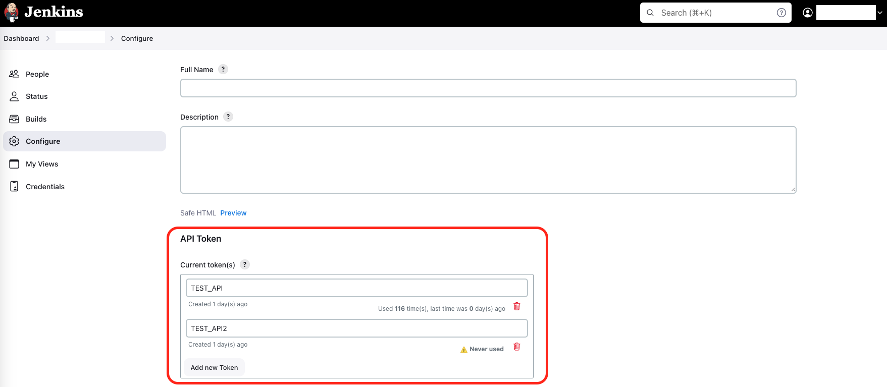

# 🚀 Trigger Jenkins Job for GitHub Actions

[](https://github.com/appleboy/jenkins-action/actions/workflows/trivy.yml)

[GitHub Action](https://github.com/features/actions) for trigger [jenkins](https://jenkins.io/) jobs.


## Usage

Trigger New Jenkins Job.

```yaml
name: trigger jenkins job
on: [push]
jobs:

  build:
    name: Build
    runs-on: ubuntu-latest
    steps:
    - name: trigger single Job
      uses: appleboy/jenkins-action@master
      with:
        url: "http://example.com"
        user: "example"
        token: ${{ secrets.TOKEN }}
        job: "foobar"
```

## Jenkins Setting

Setup the Jenkins server using the docker command:

```sh
docker run \
  --name jenkins-docker \
  -d --restart always \
  -p 8080:8080 -p 50000:50000 \
  -v /data/jenkins:/var/jenkins_home \
  jenkins/jenkins:lts
```

Please make sure that you create the `/data/jenkins` before starting the Jenkins.

Go to user profile and click on `Configure`:



## Example

Trigger multiple jenkins job:

```yaml
- name: trigger multiple Job
  uses: appleboy/jenkins-action@v1.1.1
  with:
    url: http://example.com
    user: example
    token: ${{ secrets.TOKEN }}
    job: job_1,job_2
```

Trigger jenkins job with parameters:

```yaml
- name: trigger Job with parameters
  uses: appleboy/jenkins-action@v1.1.1
  with:
    url: http://example.com
    user: example
    token: ${{ secrets.TOKEN }}
    job: job_1
    parameters: param1=value1,param2=value2
```

Trigger jenkins job using remote token:

```yaml
- name: trigger Job with remote token
  uses: appleboy/jenkins-action@v1.1.1
  with:
    url: http://example.com
    remote_token: ${{ secrets.REMOTE_TOKEN }}
    job: job_1
```

Wait for job completion with custom timeout:

```yaml
- name: trigger Job and wait for completion
  uses: appleboy/jenkins-action@v1.1.1
  with:
    url: http://example.com
    user: example
    token: ${{ secrets.TOKEN }}
    job: job_1
    wait: true
    poll_interval: 5s
    timeout: 60m
```

## Input variables

| Parameter      | Required      | Default | Description                                            |
| -------------- | ------------- | ------- | ------------------------------------------------------ |
| url            | Yes           |         | Jenkins base URL (e.g., `http://jenkins.example.com/`) |
| user           | Conditional\* |         | Jenkins username                                       |
| token          | Conditional\* |         | Jenkins API token                                      |
| remote_token   | Conditional\* |         | Jenkins remote trigger token                           |
| job            | Yes           |         | Jenkins job name(s) - can specify multiple             |
| parameters     | No            |         | Build parameters in `key=value` format                 |
| insecure       | No            | `false` | Allow insecure SSL connections                         |
| wait           | No            | `false` | Wait for job completion                                |
| poll_interval  | No            | `10s`   | Interval between status checks                         |
| timeout        | No            | `30m`   | Maximum time to wait for job completion                |

> \* **Authentication**: Either `user` + `token` OR `remote_token` is required.
