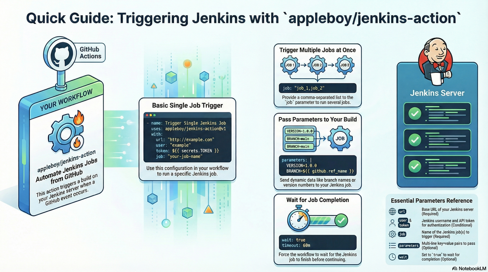
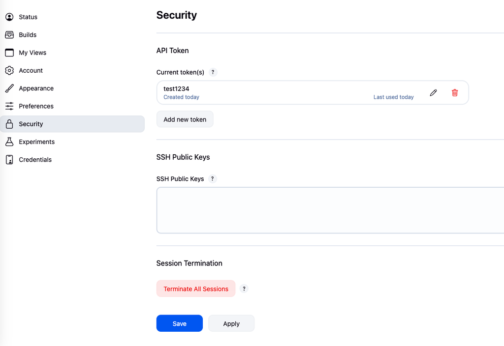

# 🚀 Trigger Jenkins Job for GitHub Actions

[](https://github.com/appleboy/jenkins-action/actions/workflows/trivy.yml)

English | [繁體中文](./README.zh-TW.md) | [简体中文](./README.zh-CN.md)

[GitHub Action](https://github.com/features/actions) for trigger [jenkins](https://jenkins.io/) jobs.

## Table of Contents

- [🚀 Trigger Jenkins Job for GitHub Actions](#-trigger-jenkins-job-for-github-actions)
  - [Table of Contents](#table-of-contents)
  - [Slides](#slides)
  - [Usage](#usage)
  - [Jenkins Setting](#jenkins-setting)
  - [Authentication and CSRF Protection](#authentication-and-csrf-protection)
    - [Understanding CSRF Protection in Jenkins](#understanding-csrf-protection-in-jenkins)
    - [Authentication Methods](#authentication-methods)
      - [1. User + API Token (Recommended)](#1-user--api-token-recommended)
      - [2. Remote Token (Legacy)](#2-remote-token-legacy)
  - [Example](#example)
  - [Input variables](#input-variables)
  - [Output variables](#output-variables)
  - [Complete Workflow Example](#complete-workflow-example)

## Slides

Check out [Connecting Your Worlds: A Guide to Integrating GitHub Actions and Jenkins](https://speakerdeck.com/appleboy/connecting-your-worlds-a-guide-to-integrating-github-actions-and-jenkins) for more details.



## Usage

Trigger New Jenkins Job.

```yaml
name: trigger jenkins job
on: [push]
jobs:
  build:
    name: Build
    runs-on: ubuntu-latest
    steps:
      - name: trigger single Job
        uses: appleboy/jenkins-action@v1
        with:
          url: "http://example.com"
          user: "example"
          token: ${{ secrets.TOKEN }}
          job: "foobar"
```

## Jenkins Setting

Setup the Jenkins server using the docker command:

```sh
docker run \
  --name jenkins-docker \
  -d --restart always \
  -p 8080:8080 -p 50000:50000 \
  -v /data/jenkins:/var/jenkins_home \
  jenkins/jenkins:lts
```

Please make sure that you create the `/data/jenkins` before starting the Jenkins.

Go to user profile and click on `Configure`:



## Authentication and CSRF Protection

### Understanding CSRF Protection in Jenkins

CSRF (Cross-Site Request Forgery) protection uses a token called **crumb** in Jenkins. This crumb is created by Jenkins and sent to the user. Any form submissions or actions resulting in modifications (like triggering builds or changing configuration) require that the crumb be provided. The crumb contains information identifying the user it was created for, so submissions with another user's token would be rejected. All of this happens in the background and has no visible impact except in rare circumstances, such as after a user's session expired and they logged in again.

### Authentication Methods

This action supports two authentication methods:

#### 1. User + API Token (Recommended)

```yaml
- name: trigger with user authentication
  uses: appleboy/jenkins-action@v1
  with:
    url: http://example.com
    user: example
    token: ${{ secrets.TOKEN }}
    job: job_1
```

**How it works:**

- Authenticates using Jenkins username and API token
- **Automatically handles CSRF protection** by fetching and including the crumb token
- The action will make an additional API call to `/crumbIssuer/api/json` to obtain the crumb
- The crumb is then included in all subsequent requests
- More secure and recommended for most use cases

**When to use:**

- Standard Jenkins installations with CSRF protection enabled (default)
- When you need full API access and security
- Production environments

#### 2. Remote Token (Legacy)

```yaml
- name: trigger with remote token
  uses: appleboy/jenkins-action@v1
  with:
    url: http://example.com
    remote_token: ${{ secrets.REMOTE_TOKEN }}
    job: job_1
```

**How it works:**

- Uses Jenkins job-specific remote trigger token
- **Bypasses CSRF protection** - does not require crumb token
- Configured per-job in Jenkins job configuration under "Build Triggers" > "Trigger builds remotely"
- Less secure as it only requires knowing the job name and remote token

**When to use:**

- Jenkins instances with CSRF protection disabled
- Legacy systems or specific security requirements
- When you only need to trigger specific jobs without full API access
- External systems that cannot handle crumb tokens

**Note:** Remote token authentication is considered less secure and should be used with caution. User + API token authentication is recommended for most use cases.

## Example

Trigger multiple jenkins job:

```yaml
- name: trigger multiple Job
  uses: appleboy/jenkins-action@v1
  with:
    url: http://example.com
    user: example
    token: ${{ secrets.TOKEN }}
    job: job_1,job_2
```

Trigger jenkins job with parameters:

```yaml
- name: trigger Job with parameters
  uses: appleboy/jenkins-action@v1
  with:
    url: http://example.com
    user: example
    token: ${{ secrets.TOKEN }}
    job: job_1
    parameters: |
      ENVIRONMENT=production
      VERSION=1.0.0
      COMMIT_SHA=${{ github.sha }}
      BRANCH=${{ github.ref_name }}
```

Trigger jenkins job using remote token:

```yaml
- name: trigger Job with remote token
  uses: appleboy/jenkins-action@v1
  with:
    url: http://example.com
    remote_token: ${{ secrets.REMOTE_TOKEN }}
    job: job_1
```

Wait for job completion with custom timeout:

```yaml
- name: trigger Job and wait for completion
  uses: appleboy/jenkins-action@v1
  with:
    url: http://example.com
    user: example
    token: ${{ secrets.TOKEN }}
    job: job_1
    wait: true
    poll_interval: 5s
    timeout: 60m
```

Use custom CA certificate for self-signed SSL:

```yaml
- name: trigger Job with custom CA certificate
  uses: appleboy/jenkins-action@v1
  with:
    url: https://jenkins.example.com
    user: example
    token: ${{ secrets.TOKEN }}
    job: job_1
    ca_cert: ${{ secrets.CA_CERT }}
```

You can also specify a file path or HTTP URL for the CA certificate:

```yaml
- name: trigger Job with CA certificate from file
  uses: appleboy/jenkins-action@v1
  with:
    url: https://jenkins.example.com
    user: example
    token: ${{ secrets.TOKEN }}
    job: job_1
    ca_cert: /path/to/ca-certificate.pem
```

## Input variables

| Parameter     | Required      | Default | Description                                                      |
| ------------- | ------------- | ------- | ---------------------------------------------------------------- |
| url           | Yes           |         | Jenkins base URL (e.g., `http://jenkins.example.com/`)           |
| user          | Conditional\* |         | Jenkins username                                                 |
| token         | Conditional\* |         | Jenkins API token                                                |
| remote_token  | Conditional\* |         | Jenkins remote trigger token                                     |
| job           | Yes           |         | Jenkins job name(s) - can specify multiple                       |
| parameters    | No            |         | Build parameters in multi-line `key=value` format (one per line) |
| insecure      | No            | `false` | Allow insecure SSL connections                                   |
| wait          | No            | `false` | Wait for job completion                                          |
| poll_interval | No            | `10s`   | Interval between status checks                                   |
| timeout       | No            | `30m`   | Maximum time to wait for job completion                          |
| debug         | No            | `false` | Enable debug mode to show detailed parameter information         |
| ca_cert       | No            |         | Custom CA certificate (PEM content, file path, or HTTP URL)      |

> \* **Authentication**: Either `user` + `token` OR `remote_token` is required.

## Output variables

| Parameter | Description                                                                |
| --------- | -------------------------------------------------------------------------- |
| result    | Jenkins job result (`SUCCESS`, `FAILURE`, `ABORTED`, `UNSTABLE`, or empty) |
| url       | Jenkins job URL                                                            |

Usage example:

```yaml
- name: Trigger Jenkins Job
  id: jenkins
  uses: appleboy/jenkins-action@v1
  with:
    url: ${{ secrets.JENKINS_URL }}
    user: ${{ secrets.JENKINS_USER }}
    token: ${{ secrets.JENKINS_TOKEN }}
    job: your-job-name
    wait: true

- name: Use outputs
  run: |
    echo "Result: ${{ steps.jenkins.outputs.result }}"
    echo "URL: ${{ steps.jenkins.outputs.url }}"
```

## Complete Workflow Example

Here's a complete example that demonstrates a real-world CI/CD workflow with conditional triggers, multiple environments, and job status handling:

```yaml
name: Deploy via Jenkins
on:
  push:
    branches: [main, develop]
  pull_request:
    branches: [main]

jobs:
  deploy:
    name: Trigger Jenkins Deployment
    runs-on: ubuntu-latest
    steps:
      - name: Checkout code
        uses: actions/checkout@v4

      - name: Set environment variables
        id: vars
        run: |
          if [[ "${{ github.ref }}" == "refs/heads/main" ]]; then
            echo "environment=production" >> $GITHUB_OUTPUT
            echo "jenkins_job=deploy-prod" >> $GITHUB_OUTPUT
          else
            echo "environment=staging" >> $GITHUB_OUTPUT
            echo "jenkins_job=deploy-staging" >> $GITHUB_OUTPUT
          fi

      - name: Trigger Jenkins Build and Wait
        uses: appleboy/jenkins-action@v1
        with:
          url: ${{ secrets.JENKINS_URL }}
          user: ${{ secrets.JENKINS_USER }}
          token: ${{ secrets.JENKINS_TOKEN }}
          job: ${{ steps.vars.outputs.jenkins_job }}
          wait: true
          timeout: 30m
          poll_interval: 10s
          parameters: |
            ENVIRONMENT=${{ steps.vars.outputs.environment }}
            VERSION=${{ github.sha }}
            BRANCH=${{ github.ref_name }}
            TRIGGERED_BY=${{ github.actor }}

      - name: Notify on success
        if: success()
        run: echo "Jenkins job completed successfully!"

      - name: Notify on failure
        if: failure()
        run: echo "Jenkins job failed!"
```
