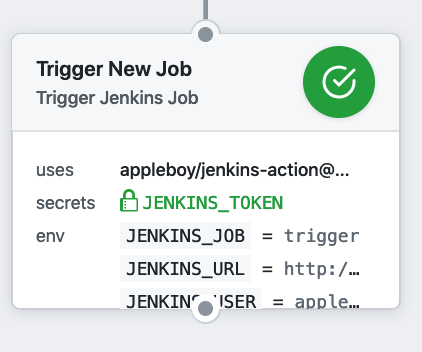
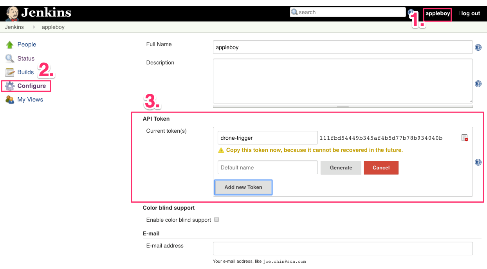

# 🚀 Trigger Jenkins Job for GitHub Actions

[GitHub Action](https://github.com/features/actions) for trigger [jenkins](https://jenkins.io/) jobs.



## Usage

Trigger New Jenkins Job.

```yaml
name: trigger jenkins job
on: [push]
jobs:

  build:
    name: Build
    runs-on: ubuntu-latest
    steps:
    - name: trigger single Job
      uses: appleboy/jenkins-action@master
      with:
        url: "http://example.com"
        user: "example"
        token: ${{ secrets.TOKEN }}
        job: "foobar"
```

## Jenkins Setting

Setup the Jenkins server using the docker command:

```sh
docker run \
  --name jenkins \
  -d --restart always \
  -p 8080:8080 -p 50000:50000 \
  -v /data/jenkins:/var/jenkins_home \
  jenkins/jenkins:lts
```

Please make sure that you create the `/data/jenkins` before starting the Jenkins. Create the new API token as below:



## Example

Trigger multiple jenkins job:

```yaml
- name: trigger multiple Job
  uses: appleboy/jenkins-action@master
  with:
    url: "http://example.com"
    user: "example"
    token: ${{ secrets.TOKEN }}
    job: "job_1,job_2"
```

## Input variables

* url - Required. jenkins base url.
* user - Required. jenkins user.
* job - Required. jenkins job name.
* token - Required. jenkins api token.
