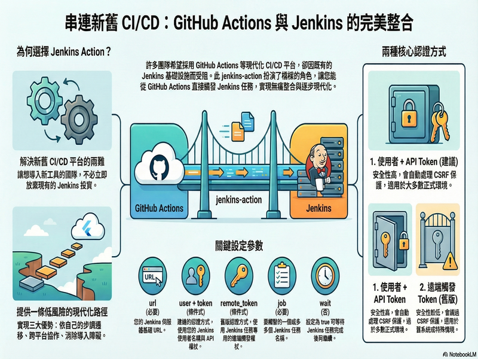

# 🚀 GitHub Actions 触发 Jenkins 任务

[](https://github.com/appleboy/jenkins-action/actions/workflows/trivy.yml)

[English](./README.md) | [繁體中文](./README.zh-TW.md) | 简体中文

用于触发 [Jenkins](https://jenkins.io/) 任务的 [GitHub Action](https://github.com/features/actions)。

## 目录

- [🚀 GitHub Actions 触发 Jenkins 任务](#-github-actions-触发-jenkins-任务)
  - [目录](#目录)
  - [为什么要使用 Jenkins Action？](#为什么要使用-jenkins-action)
  - [简报](#简报)
  - [使用方式](#使用方式)
  - [Jenkins 设置](#jenkins-设置)
  - [身份验证与 CSRF 保护](#身份验证与-csrf-保护)
    - [了解 Jenkins 的 CSRF 保护](#了解-jenkins-的-csrf-保护)
    - [认证方式](#认证方式)
      - [1. 用户 + API Token（推荐）](#1-用户--api-token推荐)
      - [2. 远程 Token（旧版）](#2-远程-token旧版)
  - [示例](#示例)
  - [输入参数](#输入参数)
  - [输出变量](#输出变量)
  - [完整工作流程示例](#完整工作流程示例)

## 为什么要使用 Jenkins Action？

在许多企业内部，不同团队各自使用不同的 CI/CD 平台。旧有系统多半仍在 Jenkins 上运行，而 GitHub Actions 和 Gitea Actions 等现代化平台则提供了更强大的功能与更佳的开发体验。这造成了一个两难：团队想要采用新工具，却无法舍弃既有的 Jenkins 基础设施。

**Jenkins Action 正是为了解决这个问题而生。** 它在现代 CI/CD 平台与 Jenkins 之间建立了无缝桥接，让团队能够：

- **按照自己的步调迁移** - 立即开始使用 GitHub Actions 或 Gitea Actions，同时保留对既有 Jenkins 任务的调用，无需立即改写
- **跨平台协作** - 不同团队可以使用各自偏好的工具，同时维持系统间的互通性
- **消除采用障碍** - 解决"要么全换、要么不换"的困境，让团队能够逐步现代化

通过串接现代化的 GitHub Actions 或 Gitea Actions 工作流程与既有的 Jenkins 基础设施，这个 action 为组织提供了一条实际可行、低风险的 CI/CD 现代化路径。

## 简报

查看 [Connecting Your Worlds: A Guide to Integrating GitHub Actions and Jenkins](https://speakerdeck.com/appleboy/connecting-your-worlds-a-guide-to-integrating-github-actions-and-jenkins) 了解更多详情。



## 使用方式

触发新的 Jenkins 任务。

```yaml
name: trigger jenkins job
on: [push]
jobs:

  build:
    name: Build
    runs-on: ubuntu-latest
    steps:
    - name: trigger single Job
      uses: appleboy/jenkins-action@v1
      with:
        url: "http://example.com"
        user: "example"
        token: ${{ secrets.TOKEN }}
        job: "foobar"
```

## Jenkins 设置

使用 docker 命令设置 Jenkins 服务器：

```sh
docker run \
  --name jenkins-docker \
  -d --restart always \
  -p 8080:8080 -p 50000:50000 \
  -v /data/jenkins:/var/jenkins_home \
  jenkins/jenkins:lts
```

请确保在启动 Jenkins 之前创建 `/data/jenkins` 目录。

前往用户配置文件并点击 `Configure`：


## 身份验证与 CSRF 保护

### 了解 Jenkins 的 CSRF 保护

CSRF（跨站请求伪造）保护使用在 Jenkins 中称为 **crumb** 的 token。此 crumb 由 Jenkins 创建并发送给用户。任何表单提交或导致修改的操作（如触发构建或更改配置）都需要提供 crumb。crumb 包含识别其创建对象的用户信息，因此使用其他用户 token 的提交将被拒绝。所有这些都在后台进行，除了在极少数情况下（例如用户的 session 过期并重新登录后）外，不会产生可见的影响。

更多详情请参阅 [Jenkins CSRF Protection 文档](https://www.jenkins.io/doc/book/security/csrf-protection/)。

### 认证方式

此 action 支持两种认证方式：

#### 1. 用户 + API Token（推荐）

```yaml
- name: trigger with user authentication
  uses: appleboy/jenkins-action@v1
  with:
    url: http://example.com
    user: example
    token: ${{ secrets.TOKEN }}
    job: job_1
```

**运作方式：**

- 使用 Jenkins 用户名和 API token 进行认证
- **自动处理 CSRF 保护**，会获取并包含 crumb token
- action 会额外调用 `/crumbIssuer/api/json` API 来获取 crumb
- crumb 会被包含在所有后续的请求中
- 更安全且推荐在大多数情况下使用

**何时使用：**

- 默认启用 CSRF 保护的标准 Jenkins 安装
- 需要完整 API 访问和安全性时
- 生产环境

#### 2. 远程 Token（旧版）

```yaml
- name: trigger with remote token
  uses: appleboy/jenkins-action@v1
  with:
    url: http://example.com
    remote_token: ${{ secrets.REMOTE_TOKEN }}
    job: job_1
```

**运作方式：**

- 使用 Jenkins 任务特定的远程触发 token
- **绕过 CSRF 保护** - 不需要 crumb token
- 在 Jenkins 任务配置中的"构建触发器">"远程触发构建"进行配置
- 较不安全，因为只需要知道任务名称和远程 token

**何时使用：**

- 停用 CSRF 保护的 Jenkins 实例
- 旧版系统或特定安全需求
- 仅需要触发特定任务而不需要完整 API 访问权限时
- 无法处理 crumb token 的外部系统

**注意：** 远程 token 认证被认为较不安全，应谨慎使用。推荐在大多数情况下使用"用户 + API token"认证方式。

## 示例

触发多个 Jenkins 任务：

```yaml
- name: trigger multiple Job
  uses: appleboy/jenkins-action@v1
  with:
    url: http://example.com
    user: example
    token: ${{ secrets.TOKEN }}
    job: job_1,job_2
```

使用参数触发 Jenkins 任务：

```yaml
- name: trigger Job with parameters
  uses: appleboy/jenkins-action@v1
  with:
    url: http://example.com
    user: example
    token: ${{ secrets.TOKEN }}
    job: job_1
    parameters: |
      ENVIRONMENT=production
      VERSION=1.0.0
      COMMIT_SHA=${{ github.sha }}
      BRANCH=${{ github.ref_name }}
```

使用远程 token 触发 Jenkins 任务：

```yaml
- name: trigger Job with remote token
  uses: appleboy/jenkins-action@v1
  with:
    url: http://example.com
    remote_token: ${{ secrets.REMOTE_TOKEN }}
    job: job_1
```

等待任务完成并自定义超时时间：

```yaml
- name: trigger Job and wait for completion
  uses: appleboy/jenkins-action@v1
  with:
    url: http://example.com
    user: example
    token: ${{ secrets.TOKEN }}
    job: job_1
    wait: true
    poll_interval: 5s
    timeout: 60m
```

使用自定义 CA 证书（用于自签 SSL）：

```yaml
- name: trigger Job with custom CA certificate
  uses: appleboy/jenkins-action@v1
  with:
    url: https://jenkins.example.com
    user: example
    token: ${{ secrets.TOKEN }}
    job: job_1
    ca_cert: ${{ secrets.CA_CERT }}
```

您也可以指定文件路径或 HTTP URL 来加载 CA 证书：

```yaml
- name: trigger Job with CA certificate from file
  uses: appleboy/jenkins-action@v1
  with:
    url: https://jenkins.example.com
    user: example
    token: ${{ secrets.TOKEN }}
    job: job_1
    ca_cert: /path/to/ca-certificate.pem
```

## 输入参数

| 参数           | 必填          | 默认值  | 说明                                                         |
| -------------- | ------------- | ------- | ------------------------------------------------------------ |
| url            | 是            |         | Jenkins 基础 URL（例如：`http://jenkins.example.com/`）      |
| user           | 条件式\*      |         | Jenkins 用户名                                               |
| token          | 条件式\*      |         | Jenkins API token                                            |
| remote_token   | 条件式\*      |         | Jenkins 远程触发 token                                       |
| job            | 是            |         | Jenkins 任务名称 - 可指定多个                                |
| parameters     | 否            |         | 构建参数，多行 `key=value` 格式（每行一个）                  |
| insecure       | 否            | `false` | 允许不安全的 SSL 连接                                        |
| wait           | 否            | `false` | 等待任务完成                                                 |
| poll_interval  | 否            | `10s`   | 状态检查间隔                                                 |
| timeout        | 否            | `30m`   | 等待任务完成的最长时间                                       |
| debug          | 否            | `false` | 启用调试模式以显示详细的参数信息                             |
| ca_cert        | 否            |         | 自定义 CA 证书（PEM 内容、文件路径或 HTTP URL）              |

> \* **认证方式**：需要 `user` + `token` 或 `remote_token` 其中一种。

## 输出变量

| 参数   | 说明                                                                     |
| ------ | ------------------------------------------------------------------------ |
| result | Jenkins 任务结果（`SUCCESS`、`FAILURE`、`ABORTED`、`UNSTABLE` 或空值）   |
| url    | Jenkins 任务 URL                                                         |

使用示例：

```yaml
- name: Trigger Jenkins Job
  id: jenkins
  uses: appleboy/jenkins-action@v1
  with:
    url: ${{ secrets.JENKINS_URL }}
    user: ${{ secrets.JENKINS_USER }}
    token: ${{ secrets.JENKINS_TOKEN }}
    job: your-job-name
    wait: true

- name: Use outputs
  run: |
    echo "Result: ${{ steps.jenkins.outputs.result }}"
    echo "URL: ${{ steps.jenkins.outputs.url }}"
```

## 完整工作流程示例

以下是一个完整的示例，展示了具有条件触发、多环境和任务状态处理的实际 CI/CD 工作流程：

```yaml
name: Deploy via Jenkins
on:
  push:
    branches: [main, develop]
  pull_request:
    branches: [main]

jobs:
  deploy:
    name: Trigger Jenkins Deployment
    runs-on: ubuntu-latest
    steps:
      - name: Checkout code
        uses: actions/checkout@v4

      - name: Set environment variables
        id: vars
        run: |
          if [[ "${{ github.ref }}" == "refs/heads/main" ]]; then
            echo "environment=production" >> $GITHUB_OUTPUT
            echo "jenkins_job=deploy-prod" >> $GITHUB_OUTPUT
          else
            echo "environment=staging" >> $GITHUB_OUTPUT
            echo "jenkins_job=deploy-staging" >> $GITHUB_OUTPUT
          fi

      - name: Trigger Jenkins Build and Wait
        uses: appleboy/jenkins-action@v1
        with:
          url: ${{ secrets.JENKINS_URL }}
          user: ${{ secrets.JENKINS_USER }}
          token: ${{ secrets.JENKINS_TOKEN }}
          job: ${{ steps.vars.outputs.jenkins_job }}
          wait: true
          timeout: 30m
          poll_interval: 10s
          parameters: |
            ENVIRONMENT=${{ steps.vars.outputs.environment }}
            VERSION=${{ github.sha }}
            BRANCH=${{ github.ref_name }}
            TRIGGERED_BY=${{ github.actor }}

      - name: Notify on success
        if: success()
        run: echo "Jenkins 任务执行成功！"

      - name: Notify on failure
        if: failure()
        run: echo "Jenkins 任务执行失败！"
```
